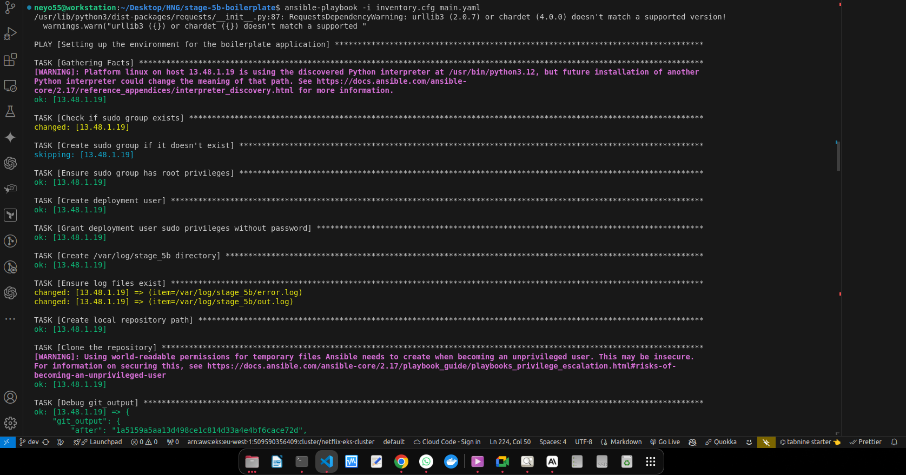

# Automated Deployment and Configuration with Ansible for Boilerplate Application

## Overview
This project involves setting up a new instance of the assigned boilerplate using Infrastructure as Code (IaC) with Ansible. The setup includes cloning the repository, installing dependencies, configuring PostgreSQL, setting up a messaging queue, configuring the application and Nginx, and setting up logging.

## Table of Contents
- [Automated Deployment and Configuration with Ansible for Boilerplate Application](#automated-deployment-and-configuration-with-ansible-for-boilerplate-application)
  - [Overview](#overview)
  - [Table of Contents](#table-of-contents)
  - [Clone and Deploy](#clone-and-deploy)
  - [Install Dependencies](#install-dependencies)
  - [Setup PostgreSQL](#setup-postgresql)
  - [Messaging Queue](#messaging-queue)
  - [Application Configuration](#application-configuration)
  - [Logging](#logging)
  - [User and Directory Setup](#user-and-directory-setup)
  - [Database and Dependencies](#database-and-dependencies)
  - [Application and Proxy Setup](#application-and-proxy-setup)
    - [Playbook Task](#playbook-task)
  - [Logging Configuration](#logging-configuration)
  - [Files](#files)
    - [ansible.cfg](#ansiblecfg)
    - [inventory.cfg](#inventorycfg)
    - [Template File (nginx.conf.j2)](#template-file-nginxconfj2)
    - [main.yaml](#mainyaml)
    - [Ansible Playbook Script (main.yaml)](#ansible-playbook-script-mainyaml)
    - [Summary](#summary)

## Clone and Deploy
1. Clone the DevOps branch of your boilerplate repository to a Linux server:
   ```sh
   git clone -b devops https://github.com/hngprojects/hng_boilerplate_python_fastapi_web.git /opt/stage_5b
   ```

   

2. Deploy the boilerplate application on the server using the provided Ansible playbook.

## Install Dependencies
The playbook installs all required dependencies for the boilerplate, including Python packages and system packages.

## Setup PostgreSQL
1. Install PostgreSQL.
2. Configure a PostgreSQL database.
3. Save the admin user and credentials in `/var/secrets/pg_pw.txt`.


## Messaging Queue
Set up RabbitMQ as the messaging queue required for the application.

## Application Configuration
1. Ensure the application starts on port 3000.
2. Set up Nginx to reverse proxy the application to port 80.

## Logging
Configure stderr logs to be saved in `/var/log/stage_5b/error.log` and stdout logs in `/var/log/stage_5b/out.log`. Ensure both log files are owned by the `hng` user.

Output of the error.log


Output of the out.log


## User and Directory Setup
1. Create a user named `hng` with sudo privileges.
2. Clone the repository into the `/opt` directory with the name `stage_5b`

```sh
   sudo adduser hng
   sudo usermod -aG sudo hng
   sudo chown -R hng:hng /opt/stage_5b
```

Sudo Group User


stage_5b directory is Owned by HNG User


HNG Execution Permission without password 


## Database and Dependencies
1. Install PostgreSQL and save the admin credentials in `/var/secrets/pg_pw.txt`.
2. Install all application dependencies, including databases and messaging queues, and configure the environment variables or application settings accordingly.

## Application and Proxy Setup
1. Ensure the application is running on `127.0.0.1:3000` without exposing port 3000 externally.
2. Install Nginx 1.26 and configure it to reverse proxy requests from port 80 to your application.

### Playbook Task
- The `main.py` file is configured to ensure the application runs on `127.0.0.1:3000`, making it accessible only from the local host:
  ```yaml
  - name: Update main.py to run on port 3000
    replace:
      path: "{{ local_repo_path }}/main.py"
      regexp: 'port=7001'
      replace: 'port={{ app_port }}'
  ```
- Nginx is set up to listen on port 80 and proxy requests to `127.0.0.1:3000`, ensuring that port 3000 is not exposed externally:
  ```nginx
  server {
      listen 80;
      server_name localhost;

      location / {
          proxy_pass http://127.0.0.1:3000;
          proxy_set_header Host $host;
          proxy_set_header X-Real-IP $remote_addr;
          proxy_set_header X-Forwarded-For $proxy_add_x_forwarded_for;
          proxy_set_header X-Forwarded-Proto $scheme;
      }
  }
  ```

## Logging Configuration
1. Set up logging so that stderr logs are written to `/var/log/stage_5b/error.log` and stdout logs to `/var/log/stage_5b/out.log`.
2. Ensure both log files are owned by the `hng` user.

## Files

### ansible.cfg
```ini
[defaults]
remote_tmp = /tmp/.ansible-${USER}/tmp
allow_world_readable_tmpfiles = True
```

### inventory.cfg
```ini
[hng]
13.48.1.19 ansible_user=ubuntu ansible_ssh_private_key_file=/home/neyo55/Desktop/HNG/stage-5b-boilerplate/brado.pem
```

### Template File (nginx.conf.j2)
```nginx
server {
    listen 80;
    server_name localhost;

    location / {
        proxy_pass http://127.0.0.1:3000;
        proxy_set_header Host $host;
        proxy_set_header X-Real-IP $remote_addr;
        proxy_set_header X-Forwarded-For $proxy_add_x_forwarded_for;
        proxy_set_header X-Forwarded-Proto $scheme;
    }
}
```

### main.yaml

```yaml
---
- name: Setting up the environment for the boilerplate application 
  hosts: hng
  become: yes
  vars:
    # Variables for the setup
    git_branch_name: "devops"
    git_repo_url: "https://github.com/hngprojects/hng_boilerplate_python_fastapi_web.git"
    local_repo_path: "/opt/stage_5b"
    virtual_env: ".venv"
    deployment_user: "hng"
    app_port: 3000
    nginx_http_port: 80
    pg_cred_path: "/var/secrets/pg_pw.txt"
    log_stderr_path: "/var/log/stage_5b/error.log"
    log_stdout_path: "/var/log/stage_5b/out.log"
    pg_database_name: "neyo_db"
    pg_admin_user: "neyo"
    pg_admin_password: "hng@stress"
    rabbitmq_user: "neyo_rabbitmq"
    rabbitmq_password: "hng@stress"
    rabbitmq_vhost: "/myvhost"

  tasks:
    # Check if the sudo group exists
    - name: Check if sudo group exists
      command: getent group sudo
      register: sudo_group
      ignore_errors: true

    # Create the sudo group if it doesn't exist
    - name: Create sudo group if it doesn't exist
      group:
        name: sudo
        state: present
      when: sudo_group.rc != 0

    # Ensure the sudo group has root privileges
    - name: Ensure sudo group has root privileges
      lineinfile:
        path: /etc/sudoers
        state: present
        regexp: '^%sudo'
        line: '%sudo ALL=(ALL:ALL) ALL'
        validate: '/usr/sbin/visudo -cf %s'

    # Create the deployment user and add to sudo group
    - name: Create deployment user
      user:
        name: "{{ deployment_user }}"
        groups: sudo
        append: yes
        state: present
        shell: /bin/bash

    # Grant the deployment user sudo privileges without password
    - name: Grant deployment user sudo privileges without password
      lineinfile:
        path: /etc/sudoers
        state: present
        regexp: '^{{ deployment_user }}'
        line: '{{ deployment_user }} ALL=(ALL) NOPASSWD:ALL'
        validate: '/usr/sbin/visudo -cf %s'

    # Create the directory for logs
    - name: Create /var/log/stage_5b directory
      file:
        path: /var/log/stage_5b
        state: directory
        owner: "{{ deployment_user }}"
        group: "{{ deployment_user }}"
        mode: '0755'

    # Ensure log files exist
    - name: Ensure log files exist
      file:
        path: "{{ item }}"
        state: touch
        owner: "{{ deployment_user }}"
        group: "{{ deployment_user }}"
        mode:

 '0644'
      with_items:
        - "{{ log_stderr_path }}"
        - "{{ log_stdout_path }}"

    # Create the local repository path
    - name: Create local repository path
      file:
        path: "{{ local_repo_path }}"
        state: directory
        owner: "{{ deployment_user }}"
        group: "{{ deployment_user }}"
        mode: '0755'

    # Clone the repository
    - name: Clone the repository
      git:
        repo: "{{ git_repo_url }}"
        dest: "{{ local_repo_path }}"
        version: "{{ git_branch_name }}"
        force: yes
      become_user: "{{ deployment_user }}"
      register: git_output

    # Debug the git clone output
    - name: Debug git_output
      debug:
        var: git_output

    # Append git clone stdout to the log file
    - name: Append git clone stdout to log
      shell: |
        echo "{{ git_output.after }}" >> "{{ log_stdout_path }}"
      when: git_output.after is defined and git_output.after != ""

    # Append git clone stderr to the log file
    - name: Append git clone stderr to log
      shell: |
        echo "{{ git_output.before }}" >> "{{ log_stderr_path }}"
      when: git_output.before is defined and git_output.before != ""

    # Ensure python3.12-venv is installed
    - name: Ensure python3.12-venv is installed
      ansible.builtin.apt:
        name: python3.12-venv
        state: present
        update_cache: yes

    # Ensure python3-psycopg2 is installed
    - name: Ensure python3-psycopg2 is installed
      ansible.builtin.apt:
        name: python3-psycopg2
        state: present
        update_cache: yes

    # Create a virtual environment
    - name: Create virtual environment
      command: python3 -m venv "{{ local_repo_path }}/{{ virtual_env }}"
      become_user: "{{ deployment_user }}"
      args:
        chdir: "{{ local_repo_path }}"
      register: venv_output

    # Append virtual environment creation stdout to log file
    - name: Append virtualenv creation stdout to log
      shell: |
        echo "{{ venv_output.stdout }}" >> "{{ log_stdout_path }}"
      when: venv_output.stdout is defined and venv_output.stdout != ""

    # Append virtual environment creation stderr to log file
    - name: Append virtualenv creation stderr to log
      shell: |
        echo "{{ venv_output.stderr }}" >> "{{ log_stderr_path }}"
      when: venv_output.stderr is defined and venv_output.stderr != ""

    # Activate the virtual environment and display its path
    - name: Activate virtual environment and display its path
      shell: |
        . {{ local_repo_path }}/{{ virtual_env }}/bin/activate && echo $VIRTUAL_ENV
      register: venv_path
      become_user: "{{ deployment_user }}"
      args:
        executable: /bin/bash

    # Append virtual environment activation stdout to log file
    - name: Append virtual environment activation stdout to log
      shell: |
        echo "{{ venv_path.stdout }}" >> "{{ log_stdout_path }}"
      when: venv_path.stdout is defined and venv_path.stdout != ""

    # Append virtual environment activation stderr to log file
    - name: Append virtual environment activation stderr to log
      shell: |
        echo "{{ venv_path.stderr }}" >> "{{ log_stderr_path }}"
      when: venv_path.stderr is defined and venv_path.stderr != ""

    # Print virtual environment path
    - name: Print virtual environment path
      debug:
        msg: "Virtual environment path: {{ venv_path.stdout }}"

    # Install dependencies from requirements.txt
    - name: Install dependencies from requirements.txt
      pip:
        requirements: "{{ local_repo_path }}/requirements.txt"
        virtualenv: "{{ local_repo_path }}/{{ virtual_env }}"
      become_user: "{{ deployment_user }}"
      register: pip_output

    # Append pip install stdout to log file
    - name: Append pip install stdout to log
      shell: |
        echo "{{ pip_output.stdout }}" >> "{{ log_stdout_path }}"
      when: pip_output.stdout is defined and pip_output.stdout != ""

    # Append pip install stderr to log file
    - name: Append pip install stderr to log
      shell: |
        echo "{{ pip_output.stderr }}" >> "{{ log_stderr_path }}"
      when: pip_output.stderr is defined and pip_output.stderr != ""

    # Create /var/secrets directory
    - name: Create "/var/secrets"
      file:
        path: /var/secrets
        state: directory
        owner: hng
        group: hng
        mode: '0755'

    # Ensure pg_cred_path file exists and has correct permissions
    - name: Ensure pg_cred_path file exists and has correct permissions
      file:
        path: "{{ pg_cred_path }}"
        state: touch
        owner: "{{ deployment_user }}"
        group: "{{ deployment_user }}"
        mode: '0600'
      register: pg_cred_output

    # Append pg_cred_path file creation stdout to log file
    - name: Append pg_cred_path file creation stdout to log
      shell: |
        echo "{{ pg_cred_output.stdout }}" >> "{{ log_stdout_path }}"
      when: pg_cred_output.stdout is defined and pg_cred_output.stdout != ""

    # Append pg_cred_path file creation stderr to log file
    - name: Append pg_cred_path file creation stderr to log
      shell: |
        echo "{{ pg_cred_output.stderr }}" >> "{{ log_stderr_path }}"
      when: pg_cred_output.stderr is defined and pg_cred_output.stderr != ""

    # Install PostgreSQL
    - name: Install PostgreSQL
      apt:
        name: postgresql
        state: present
      register: install_postgres_output

    # Append install PostgreSQL stdout to log file
    - name: Append install PostgreSQL stdout to log
      shell: |
        echo "{{ install_postgres_output.stdout }}" >> "{{ log_stdout_path }}"
      when: install_postgres_output.stdout is defined and install_postgres_output.stdout != ""

    # Append install PostgreSQL stderr to log file
    - name: Append install PostgreSQL stderr to log
      shell: |
        echo "{{ install_postgres_output.stderr }}" >> "{{ log_stderr_path }}"
      when: install_postgres_output.stderr is defined and install_postgres_output.stderr != ""

    # Ensure PostgreSQL service is running and enabled
    - name: Ensure PostgreSQL service is running
      service:
        name: postgresql
        state: started
        enabled: yes
      register: postgres_service_output

    # Append PostgreSQL service stdout to log file
    - name: Append PostgreSQL service stdout to log
      shell: |
        echo "{{ postgres_service_output.stdout }}" >> "{{ log_stdout_path }}"
      when: postgres_service_output.stdout is defined and postgres_service_output.stdout != ""

    # Append PostgreSQL service stderr to log file
    - name: Append PostgreSQL service stderr to log
      shell: |
        echo "{{ postgres_service_output.stderr }}" >> "{{ log_stderr_path }}"
      when: postgres_service_output.stderr is defined and postgres_service_output.stderr != ""

    # Create PostgreSQL database
    - name: Create PostgreSQL database and admin user
      become_user: postgres
      community.postgresql.postgresql_db:
        name: "{{ pg_database_name }}"
        state: present
      register: create_db_output

    # Append create PostgreSQL database stdout to log file
    - name: Append create PostgreSQL database stdout to log
      shell: |
        echo "{{ create_db_output.stdout }}" >> "{{ log_stdout_path }}"
      when: create_db_output.stdout is defined and create_db_output.stdout != ""

    # Append create PostgreSQL database stderr to log file
    - name: Append create PostgreSQL database stderr to log
      shell: |
        echo "{{ create_db_output.stderr }}" >> "{{ log_stderr_path }}"
      when: create_db_output.stderr is defined and create_db_output.stderr != ""

    # Create PostgreSQL admin user
    - name: Create PostgreSQL admin user
      become_user: postgres
      community.postgresql.postgresql_user:
        name: "{{ pg_admin_user }}"
        password: "{{ pg_admin_password }}"
        db: "{{ pg_database_name }}"
        priv: "ALL"
        state: present
      register: create_user_output

    # Append create PostgreSQL admin user stdout to log file
    - name: Append create PostgreSQL admin user stdout to log
      shell: |
        echo "{{ create_user_output.stdout }}" >> "{{ log_stdout_path }}"
      when: create_user_output.stdout is defined and create_user_output.stdout != ""

    # Append create PostgreSQL admin user stderr to log file
    - name: Append create PostgreSQL admin user stderr to log
      shell: |
        echo "{{ create_user_output.stderr }}" >> "{{ log_stderr_path }}"
      when: create_user_output.stderr is defined and create_user_output.stderr != ""

    # Save PostgreSQL admin credentials to pg_cred_path
    - name: Save PostgreSQL admin credentials to pg_cred_path
      copy:
        content: "postgres://{{ pg_admin_user }}:{{ pg_admin_password }}@localhost:5432/{{ pg_database_name }}"
        dest: "{{ pg_cred_path }}"
        owner: "{{ deployment_user }}"
        group: "{{ deployment_user }}"
        mode: '0600'

    # Create dummy table in PostgreSQL database
    - name: Create dummy table in PostgreSQL database
      become_user: postgres
      postgresql_query:
        db: "{{ pg_database_name }}"
        query: "CREATE TABLE IF NOT EXISTS dummy_table (column1 VARCHAR(255

), column2 VARCHAR(255));"

    # Insert dummy data into the dummy table
    - name: Create dummy data in PostgreSQL database
      become_user: postgres
      postgresql_query:
        db: "{{ pg_database_name }}"
        query: "INSERT INTO dummy_table (column1, column2) VALUES ('dummy1', 'dummy2');"

    # Install RabbitMQ
    - name: Install RabbitMQ
      apt:
        name: rabbitmq-server
        state: present
      register: install_rabbitmq_output

    - name: Append install RabbitMQ stdout to log
      shell: |
        echo "{{ install_rabbitmq_output.stdout }}" >> "{{ log_stdout_path }}"
      when: install_rabbitmq_output.stdout is defined and install_rabbitmq_output.stdout != ""

    - name: Append install RabbitMQ stderr to log
      shell: |
        echo "{{ install_rabbitmq_output.stderr }}" >> "{{ log_stderr_path }}"
      when: install_rabbitmq_output.stderr is defined and install_rabbitmq_output.stderr != ""

    - name: Ensure RabbitMQ service is running
      service:
        name: rabbitmq-server
        state: started
        enabled: yes
      register: rabbitmq_service_output

    - name: Append RabbitMQ service stdout to log
      shell: |
        echo "{{ rabbitmq_service_output.stdout }}" >> "{{ log_stdout_path }}"
      when: rabbitmq_service_output.stdout is defined and rabbitmq_service_output.stdout != ""

    - name: Append RabbitMQ service stderr to log
      shell: |
        echo "{{ rabbitmq_service_output.stderr }}" >> "{{ log_stderr_path }}"
      when: rabbitmq_service_output.stderr is defined and rabbitmq_service_output.stderr != ""

    - name: Create RabbitMQ user
      rabbitmq_user:
        user: "{{ rabbitmq_user }}"
        password: "{{ rabbitmq_password }}"
        state: present
        tags: administrator
      register: create_rabbitmq_user_output

    - name: Append create RabbitMQ user stdout to log
      shell: |
        echo "{{ create_rabbitmq_user_output.stdout }}" >> "{{ log_stdout_path }}"
      when: create_rabbitmq_user_output.stdout is defined and create_rabbitmq_user_output.stdout != ""

    - name: Append create RabbitMQ user stderr to log
      shell: |
        echo "{{ create_rabbitmq_user_output.stderr }}" >> "{{ log_stderr_path }}"
      when: create_rabbitmq_user_output.stderr is defined and create_rabbitmq_user_output.stderr != ""

    - name: Create RabbitMQ virtual host
      rabbitmq_vhost:
        name: "{{ rabbitmq_vhost }}"
        state: present
      register: create_rabbitmq_vhost_output

    - name: Append create RabbitMQ vhost stdout to log
      shell: |
        echo "{{ create_rabbitmq_vhost_output.stdout }}" >> "{{ log_stdout_path }}"
      when: create_rabbitmq_vhost_output.stdout is defined and create_rabbitmq_vhost_output.stdout != ""

    - name: Append create RabbitMQ vhost stderr to log
      shell: |
        echo "{{ create_rabbitmq_vhost_output.stderr }}" >> "{{ log_stderr_path }}"
      when: create_rabbitmq_vhost_output.stderr is defined and create_rabbitmq_vhost_output.stderr != ""

    - name: Set permissions for RabbitMQ user on vhost
      rabbitmq_user:
        user: "{{ rabbitmq_user }}"
        vhost: "{{ rabbitmq_vhost }}"
        configure_priv: ".*"
        read_priv: ".*"
        write_priv: ".*"
        state: present
      register: set_rabbitmq_permissions_output

    - name: Append set RabbitMQ permissions stdout to log
      shell: |
        echo "{{ set_rabbitmq_permissions_output.stdout }}" >> "{{ log_stdout_path }}"
      when: set_rabbitmq_permissions_output.stdout is defined and set_rabbitmq_permissions_output.stdout != ""

    - name: Append set RabbitMQ permissions stderr to log
      shell: |
        echo "{{ set_rabbitmq_permissions_output.stderr }}" >> "{{ log_stderr_path }}"
      when: set_rabbitmq_permissions_output.stderr is defined and set_rabbitmq_permissions_output.stderr != ""

    # Copy .env.sample to .env
    - name: Copy .env.sample to .env
      copy:
        src: "{{ local_repo_path }}/.env.sample"
        dest: "{{ local_repo_path }}/.env"
        owner: "{{ deployment_user }}"
        group: "{{ deployment_user }}"
        mode: '0644'
        remote_src: yes

    # Update .env file with Postgres URL
    - name: Update .env file with Postgres URL
      lineinfile:
        path: "{{ local_repo_path }}/.env"
        regexp: '^DB_URL='
        line: "DB_URL=postgresql://{{ pg_admin_user }}:{{ pg_admin_password }}@localhost:5432/{{ pg_database_name }}"

    # Update .env file with Postgres database name
    - name: Update .env file with Postgres details
      lineinfile:
        path: "{{ local_repo_path }}/.env"
        regexp: '^DB_NAME='
        line: "DB_NAME={{ pg_database_name }}"

    # Update .env file with Postgres user
    - name: Update .env file with Postgres user
      lineinfile:
        path: "{{ local_repo_path }}/.env"
        regexp: '^DB_USER='
        line: "DB_USER={{ pg_admin_user }}"

    # Update .env file with Postgres password
    - name: Update .env file with Postgres password
      lineinfile:
        path: "{{ local_repo_path }}/.env"
        regexp: '^DB_PASSWORD='
        line: "DB_PASSWORD={{ pg_admin_password }}"

    # Update .env file with RabbitMQ URL
    - name: Update .env file with RabbitMQ URL
      lineinfile:
        path: "{{ local_repo_path }}/.env"
        regexp: '^RABBITMQ_URL='
        line: "RABBITMQ_URL=amqp://{{ rabbitmq_user }}:{{ rabbitmq_password }}@localhost:5672/{{ rabbitmq_vhost }}"

    # Update main.py to run on port 3000
    - name: Update main.py to run on port 3000
      replace:
        path: "{{ local_repo_path }}/main.py"
        regexp: 'port=7001'
        replace: 'port={{ app_port }}'

    # Run the FastAPI application server
    - name: Run the FastAPI application server
      shell: |
        . {{ local_repo_path }}/{{ virtual_env }}/bin/activate
        nohup uvicorn main:app --host 0.0.0.0 --port {{ app_port }} >> "{{ log_stdout_path }}" 2>> "{{ log_stderr_path }}" &
      args:
        chdir: "{{ local_repo_path }}"
      become_user: "{{ deployment_user }}"
      async: 0
      poll: 5
      register: app_run_output

    # Append application run stdout to log file
    - name: Append application run stdout to log
      shell: |
        echo "{{ app_run_output.stdout }}" >> "{{ log_stdout_path }}"
      when: app_run_output.stdout is defined and app_run_output.stdout != ""

    # Append application run stderr to log file
    - name: Append application run stderr to log
      shell: |
        echo "{{ app_run_output.stderr }}" >> "{{ log_stderr_path }}"
      when: app_run_output.stderr is defined and app_run_output.stderr != ""

    # Add the Nginx official repository key
    - name: Add the Nginx official repository key
      ansible.builtin.apt_key:
        url: http://nginx.org/keys/nginx_signing.key
        state: present
      become: yes

    # Add the Nginx official repository
    - name: Add the Nginx official repository
      ansible.builtin.apt_repository:
        repo: "deb http://nginx.org/packages/ubuntu/ {{ ansible_distribution_release }} nginx"
        state: present
      become: yes
      register: install_nginx_output

    # Install Nginx 1.26
    - name: Install Nginx 1.26
      apt:
        name: nginx=1.26.0-1~{{ ansible_distribution_release }}
        state: present
      register: install_nginx_output  

    # Append install Nginx stdout to log file
    - name: Append install Nginx stdout to log
      shell: |
        echo "{{ install_nginx_output.stdout }}" >> "{{ log_stdout_path }}"
      when: install_nginx_output.stdout is defined and install_nginx_output.stdout != ""

    # Append install Nginx stderr to log file
    - name: Append install Nginx stderr to log
      shell: |
        echo "{{ install_nginx_output.stderr }}" >> "{{ log_stderr_path }}"
      when: install_nginx_output.stderr is defined and install_nginx_output.stderr != ""

    # Remove default Nginx site configuration
    - name: Remove default Nginx site configuration
      file:
        path: /etc/nginx/conf.d/default.conf
        state: absent
      notify:
        - restart nginx

    # Copy custom Nginx configuration from template
    - name: Copy custom Nginx configuration
      template:
        src: nginx.conf.j2
        dest: /etc/nginx/conf.d/default.conf
      notify:
        - restart nginx

  # Handlers to restart Nginx service
  handlers:
    - name: restart nginx
      service:
        name: nginx
        state: restarted
```

### Ansible Playbook Script (main.yaml)

The playbook script is the

 main automation script that Ansible will execute. It contains a series of tasks that set up the environment, install necessary software, and configure the application. Here's a breakdown:

1. **Environment Setup**:
    - **Check and Create Sudo Group**: Ensures the `sudo` group exists and has proper privileges.
    - **Create Deployment User**: Creates a new user for deploying the application with sudo privileges.
    - **Logging Setup**: Creates directories and files for logging application output and errors.
    - **Local Repository Setup**: Clones the application repository to the specified path.

2. **Python and Virtual Environment Setup**:
    - **Install Dependencies**: Installs necessary Python packages.
    - **Create Virtual Environment**: Sets up a virtual environment for the application.
    - **Install Application Dependencies**: Installs Python dependencies from `requirements.txt`.

3. **Database Setup**:
    - **Install PostgreSQL**: Installs PostgreSQL and ensures the service is running.
    - **Create Database and User**: Sets up the database and admin user, saving credentials securely.

4. **RabbitMQ Setup**:
    - **Install RabbitMQ**: Installs RabbitMQ server and ensures the service is running.
    - **Create RabbitMQ User and VHost**: Sets up RabbitMQ user and virtual host with appropriate permissions.

5. **Application Configuration**:
    - **Copy and Update .env File**: Copies the sample environment file and updates it with database and RabbitMQ details.
    - **Update Application Port**: Configures the application to run on the specified port.
    - **Run the Application**: Starts the FastAPI application server.

6. **Nginx Setup**:
    - **Install Nginx**: Adds Nginx repository, installs Nginx, and removes the default site configuration.
    - **Deploy Custom Nginx Configuration**: Copies the custom Nginx configuration and restarts the Nginx service.

### Summary

1. **ansible.cfg**: Configures Ansible to use specific settings for temporary files and permissions.
2. **inventory.cfg**: Lists the target host(s) and SSH authentication details.
3. **nginx.conf.j2**: Provides a template for Nginx configuration, setting up a reverse proxy to the application.
4. **Playbook Script**: Automates the setup and deployment of the FastAPI application, including user creation, software installation, service configuration, and application deployment.

When you run the playbook:

```sh
ansible-playbook -i inventory.cfg main.yaml
```

Or run the command like this for detailed verbosity:

```sh
ansible-playbook -i inventory.cfg main.yaml -b -vvv
```

Ansible will:

1. Read the inventory file **inventory.cfg** to determine which hosts to target.
2. Run the tasks defined in the **main.yaml** playbook on the targeted hosts.
3. **-b**: Run the playbook in batch mode, without prompting for confirmation.
4. **-vvv**: Increases the verbosity level of the output to the maximum level for detailed logs.

The Playbook Starts Running


The Playbook Ran Successfully


Ansible will connect to the target host defined in `inventory.cfg`, execute each task in the playbook, and apply the configurations as specified. The playbook ensures that the necessary environment is set up, dependencies are installed, and the application is correctly deployed and accessible via Nginx.

The API display page without exposing port 3000


---

This setup ensures that the boilerplate application is properly configured, deployed, and running with all necessary dependencies, databases, and services, managed and automated through Ansible.
